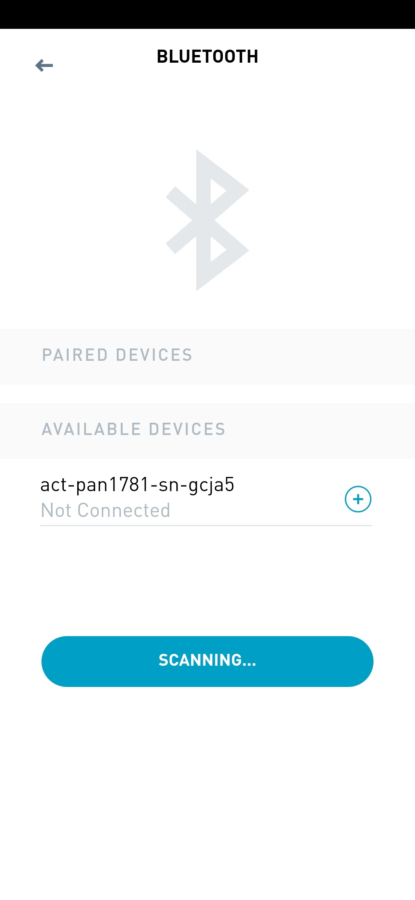
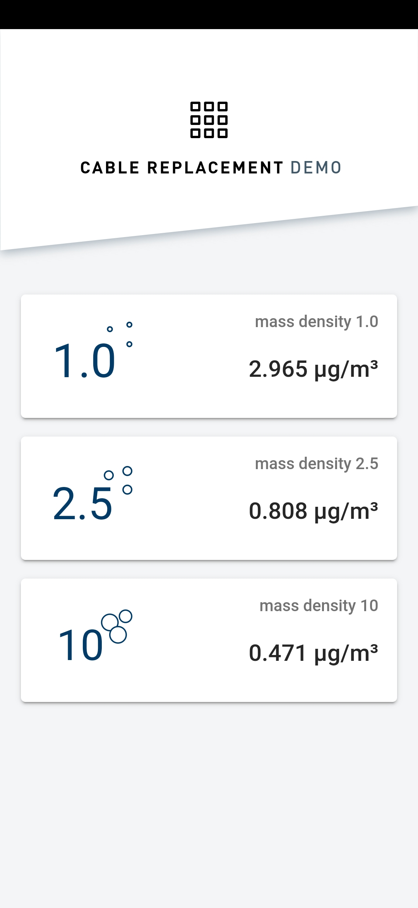

# Introduction
This App is intended as graphical user interface for the sent mass-value data measured by PAN1781 with the PM Sensor and send over Bluetooth Low Energy Service "Nordic UART Service".

* PAN1781: [PAN1781 (nRF52820) | Panasonic Industry Europe GmbH](https://industry.panasonic.eu/products/devices/wireless-connectivity/bluetooth-low-energy-modules/pan1781-nrf52820) for PAN1781 documentation.
* Particulate Matter Sensor: [Particulate matter sensor | Panasonic Industry Europe GmbH](https://industry.panasonic.eu/products/components/sensors/particulate-matter-sensor) for PM Sensor documentation.

The whole GUI is based on the Source Code provided in the repository: [cable-replacement-app](https://github.com/panasonic-industry-europe/cable-replacement-app)

## Hardware Connection

The detailed description of the wiring and connection can be found in the repository: [pan1781-sn-gcja5-BLE](https://github.com/panasonic-industry-europe/pan1781-sn-gcja5-BLE)

## Getting Started
* [Download and install the installer](https://nodejs.org/) for Node LTS.
* Install the ionic CLI globally: `npm install -g ionic`
* Install the Cordova globally: `npm install -g cordova`
* Install platform dependent packages
  * [Android](https://ionicframework.com/docs/developing/android)
  * [iOS](https://ionicframework.com/docs/developing/ios)
* Clone this repository: `Link to git repository`.
* Run `npm install` from the project root.
* Follow ["Get started with Ionic"](https://ionicframework.com/getting-started) introduction for Android or iOS.

## Deployment
### Android
Run `ionic cordova run android --prod`
### iOS
iOS apps can only be developed on macOS with Xcode installed.

Run `ionic cordova run ios --prod`

## Serve the App
Run `ionic serve`

## App Preview

| [Scan Page](src/app/scan/scan.page.html)  | [Demo Page](src/app/cable-replacement/cable-replacement.page.html)  |
| -----------------| -----|
|  |  |

## Using the GUI
Panasonic PAN1781Evaluation Board
- Prepare and flash the PAN1781 Evaluation Board like described in: [pan1781-sn-gcja5-BLE](https://github.com/panasonic-industry-europe/pan1781-sn-gcja5-BLE)
- Power the Board through USB or Pinheads

Mobile Device
- Deploy and start the App on the device
- Establish the Bluetooth Low Energy connection to the Board

Now you can enjoy the mass density values measure by the PM Sensor and sent to your device by PAN1781!